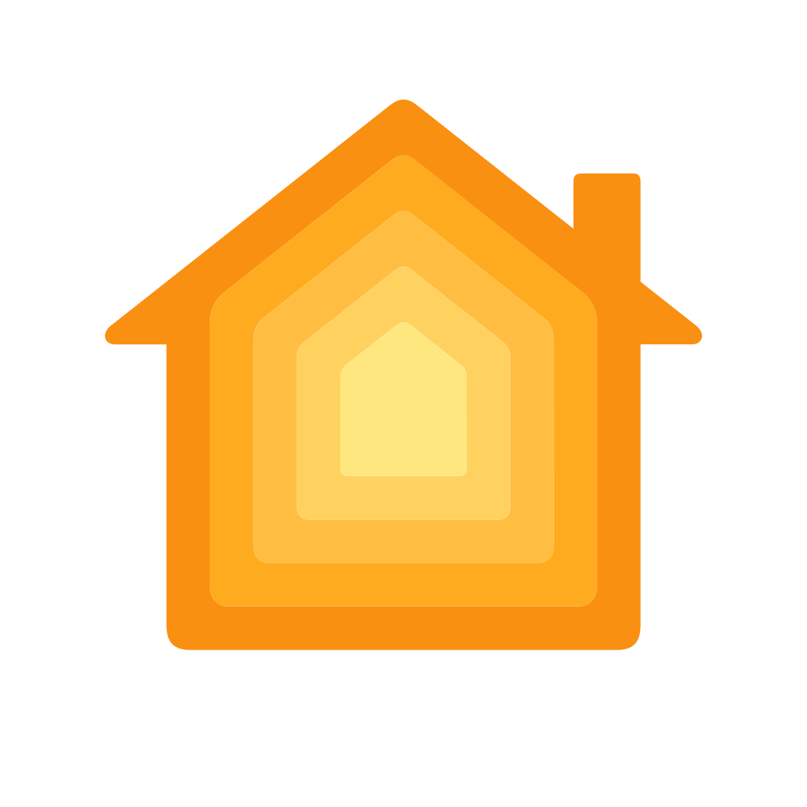

Esse repositório é destinado a síntese de placas ligadas em "web" com uma placa central
com o objetivo de chegar a uma automação residencial

hardware utilizado:
ESP-01
Módulos relay
Esp32
PCF8574 chip
Fonte 220-3.3V

API utilizadas

    

        
Alexa             - (Desenvolvimento)

         
    

    

        
HomeKit Apple     - (Desenvolvimento)

         
    

    

        
Google Assistente - (Desenvolvimento)

         
    

Versão 0.1